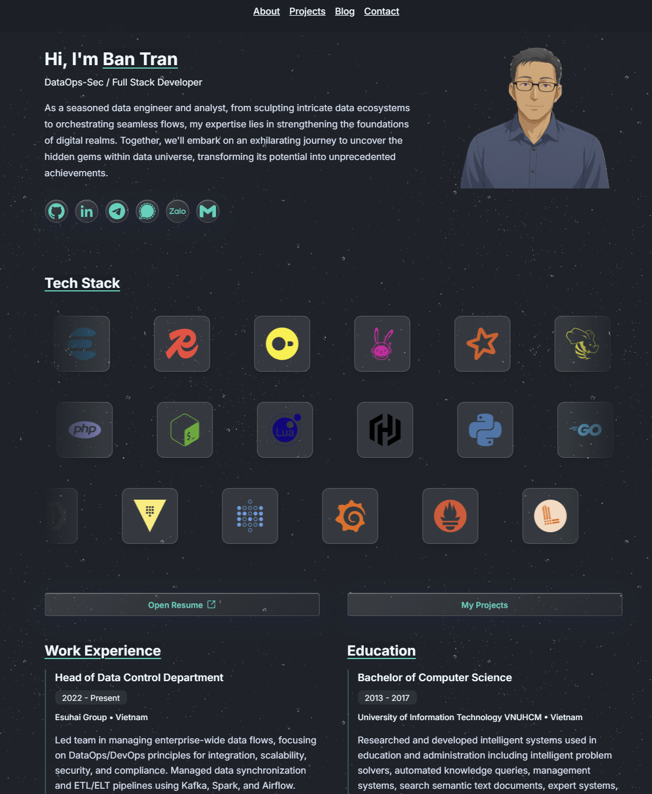

# Portfolio Website

Minimalistic and beautiful portfolio website built with [Astro](https://astro.build/) and [daisyUI](https://daisyui.com/).



## Requirements

- [Bun](https://bun.sh/) installed (latest stable recommended)

## Run Locally (Bun)

1. Install dependencies:

```bash
bun install
```

2. Start the development server:

```bash
bun run dev
```

3. Open your browser at:

```text
http://localhost:4321
```

## Build For Production

1. Build the site:

```bash
bun run build
```

2. Run the Go server locally with `.env` loaded:

```bash
bun run start:local
```

## Available Scripts

- `bun run dev`: Start Astro development server.
- `bun run build`: Build production output.
- `bun run start`: Serve the built `dist` directory with the Go server.
- `bun run start:local`: Serve the built site with local `.env` values loaded.
- `bun run format`: Format the codebase with Prettier.
- `bun run format:check`: Check formatting without writing changes.

## Customization

- Update site data in `src/consts.ts`.
- Add blog posts in `src/content/blog` using `.md` or `.mdx`.
