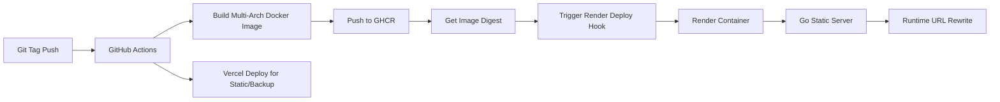

Running a personal portfolio or production website on a single platform is simple. But running it on **multiple services simultaneously without breaking canonical URLs, sitemaps, and deployments** is where things get interesting.

In this post, I share the architecture I use to keep my site continuously deployable to both **Render** and **Vercel**:

1. **Render** as the primary host (Docker + custom Go static server)
2. **Vercel** as the ultra-fast global static backup
3. **GitHub Actions + GHCR** for continuous integration and image builds
4. **Deploy by image digest** for 100% immutable releases
5. **Go runtime URL rewriting** so statically generated files behave correctly regardless of where they are deployed

## Why Use Two Hosting Providers?

A multi-service deployment gives you practical resilience without overwhelming complexity:

> [!TIP]
> **Provider Fallback:** If Render has an outage or maintenance window, traffic seamlessly fails over to Vercel.
> **Leverage Strengths:** Vercel is unmatched for Edge static delivery, while Render gives you the flexibility of running custom Docker containers (like a Go backend).
> **Safe Release Workflows:** You can validate deployments on one platform while keeping the other completely stable.

This is not multi-cloud complexity for its own sake. It is a calculated layer of operational safety for high-value pages.

## The Core Challenge: Baked-In URLs

With Static Site Generators (SSGs) like Astro, URLs are inherently baked in at build time. If you build with the wrong base URL, your output is compromised:

- Incorrect canonical links for SEO
- Sitemaps pointing to ephemeral preview domains
- OpenGraph social tags with non-canonical hosts
- Plain text files (like `robots.txt` or `llms.txt`) leaking `http://localhost:4321`

In a dual-host setup where the build environment doesn't know its final destination, these mistakes become highly visible.

## Architecture & CI/CD Flow

Here is how the continuous integration and deployment pipeline operates:



> [!IMPORTANT]
> **Deterministic Deploys:** Notice that we trigger Render using the **Image Digest** (e.g., `ghcr.io/owner/repo@sha256:...`) instead of a tag (`:latest`). Tags can be overwritten, but digests guarantee Render pulls the *exact* immutable artifact produced by CI.

## Build-Time URL Priority for Astro

For Astro output (sitemap, canonical, OG URL), establish an explicit priority order in `astro.config.mjs`:

1. `SITE_URL` (manual override)
2. `RENDER_EXTERNAL_URL` (injected by Render)
3. `VERCEL_PROJECT_PRODUCTION_URL` (canonical Vercel host)
4. `VERCEL_URL` (preview/deployment host)
5. `http://localhost:4321` (local fallback)

This fallback chain entirely avoids the classic issue where sitemap entries accidentally use Vercel preview domains.

## Building a Go Server That Rewrites URLs at Runtime

When serving static files via a custom Go container on Render, **runtime rewriting** is the ultimate safety net.

### Why runtime rewrite?
Because `RENDER_EXTERNAL_URL` isn't available during the GitHub Actions build stage, the Astro build generates static assets with the `http://localhost:4321` fallback baked in. 

A lightweight server-side replacement step in Go intercepts these files and swaps `localhost` for the actual production domain before sending them to the browser.

### The Implementation Strategy

When `RENDER_EXTERNAL_URL` is available on the server:

1. Replace `http://localhost:4321` with the full production URL.
2. Replace bare `localhost:4321` with just the hostname (crucial for UI text fields or Markdown content).

```go
// Replace full URLs
content = bytes.ReplaceAll(content, []byte("http://localhost:4321"), []byte(targetURL))

// Extract host and replace bare occurrences
targetHost := strings.TrimPrefix(strings.TrimPrefix(targetURL, "https://"), "http://")
content = bytes.ReplaceAll(content, []byte("localhost:4321"), []byte(targetHost))
```

### Where to Apply It

Apply these replacements **only** to text-based assets. Do not run text replacement on binary files (like `.webp` or `.pdf`):

- `.html` (Pages)
- `.xml` (Sitemaps, RSS)
- `.txt` (robots.txt, llms.txt)
- `.json` (Manifests, API endpoints)
- **`.md`** (Markdown files served directly)

> [!WARNING]
> Don't forget `.md` files! If you serve a raw `index.md` file (like I do for LLM crawlers), you must configure your Go server to serve it with the `text/markdown; charset=utf-8` header and include it in your text-replacement logic, otherwise, it will still render `localhost`.

## Operational Recommendations

If you adopt this multi-service deployment strategy, stick to these golden rules:

1. **One Canonical Domain:** Always enforce a single canonical domain policy for SEO, regardless of which platform serves the request.
2. **Immutable Deployments:** Always trigger deployments using SHA digests over mutable tags.
3. **Graceful Secret Handling:** In GitHub Actions, some expression contexts are strict. Map secrets into the `env` block and check for empty values safely in your shell scripts to prevent pipeline crashes.
4. **Runtime Rewrite as a Safety Net:** Use the Go rewriting logic to handle environment quirks, but keep your base config as clean as possible.

## Final Thoughts

Hosting a single repository on both Render and Vercel is highly practical for reliability and deployment flexibility. By separating your build-time URL logic from your runtime adaptation (via Go), you can achieve completely predictable, robust releases across multiple clouds.

---

*If you are building a similar setup, I highly recommend starting with a single test page (`/sitemap.xml` or `/robots.txt`) and verifying the URL behavior end-to-end on both platforms before scaling to your full site.*
